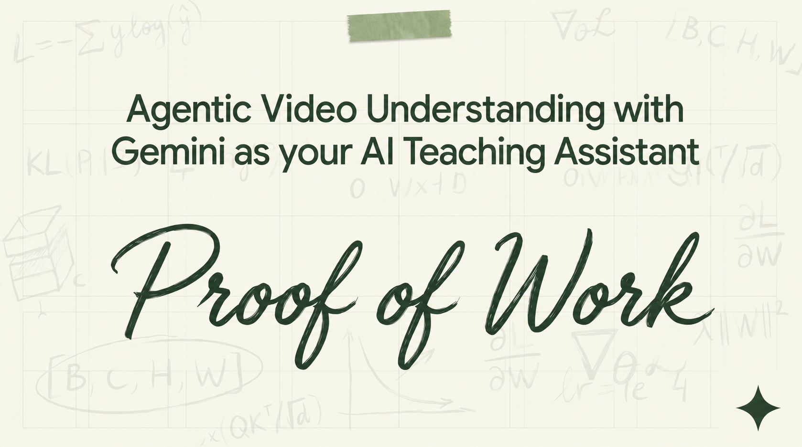

# Proof of Work: Agentic Video Understanding with Gemini as Your AI Teaching Assistant



*System Architecture, Multi-Pass Analysis, and Real-World Token Economics with Gemini's Agentic Video Models*

**By [Jigyasa Grover](https://www.linkedin.com/in/jigyasagrover/)** — Machine Learning Engineer, Google Developer Expert in Machine Learning, Google Developer Advisory Board Member, and author of *[Sculpting Data for ML: The First Act of Machine Learning](https://www.goodreads.com/book/show/56666872-sculpting-data-for-ml)*

---

## 1. The Age of Shortcuts — and Why Process Matters More Than Ever

In the age of one-click code generation, instant AI autocomplete, and copy-paste-driven development, **shipping working code has never been easier — and never meant less.**

Assessment frameworks in technical education and hiring have historically relied on a simplifying assumption: if the code passes the tests, the candidate demonstrated competence. But generative AI has structurally collapsed that assumption. When anyone can prompt their way to a working solution, the *output artifact* tells you almost nothing about the *engineer* who produced it.

What matters now is **problem-solving temperament** — the planning instinct, the debugging discipline, the intellectual honesty to verify rather than vibe-check, the willingness to ablate and iterate rather than submit the first thing that runs. These are the qualities that separate engineers who can navigate novel ambiguity from those who collapse without a template.

Consider two candidates completing the same deep learning practicum:

```
┌────────────────────────────────────────────────────────────────────────────────────────┐
│                                 OBSERVED ARTIFACT                                      │
│   • PyTorch CNN Classifier   • 87.2% CIFAR-10 Test Acc   • Unit Tests: 10/10 Passed    │
└────────────────────────────────────────┬───────────────────────────────────────────────┘
                                         │
                 ┌───────────────────────┴───────────────────────┐
                 ▼                                               ▼
┌───────────────────────────────────┐           ┌───────────────────────────────────┐
│     Candidate A (Methodical)      │           │      Candidate B (Stochastic)     │
├───────────────────────────────────┤           ├───────────────────────────────────┤
│ • Pre-computation tensor sizing   │           │ • Arbitrary copy-paste from blogs │
│ • Systematic dimension tracing    │           │ • Random permutation upon CUDA err│
│ • Critical AI diff verification   │           │ • Blind automated prompt loops    │
│ • V1 → V2 → V3 loss ablation      │           │ • Single-pass lucky seed run      │
└───────────────────────────────────┘           └───────────────────────────────────┘
```

**Identical output. Orthogonal thinking process.** The latent process trajectory:

$$\mathcal{T} = \{(t_0, a_0, s_0), (t_1, a_1, s_1), \dots, (t_n, a_n, s_n)\}$$

reveals completely different thinking processes. Candidate A demonstrates structured reasoning, fault isolation, and hypothesis-driven development; Candidate B operates through trial-and-error guessing.

**Proof of Work** was built to make this distinction visible. By treating continuous screen recordings as rich data sources, the system reconstructs, evaluates, and verifies the problem-solving *process* — not just the final output — backed by timestamped evidence.

---

## 2. The Technical Challenge: Why Naive Video Processing Doesn't Scale

Evaluating 45-to-60-minute screen recordings creates a serious compute and context-window bottleneck for standard multimodal models.

### Why Fixed-Rate Frame Extraction Fails

Standard video pipelines extract frames at a fixed rate (typically 1 FPS). For a 45-minute developer session:

$$\text{Total Frames} = 45\text{ min} \times 60\text{ sec/min} \times 1\text{ frame/sec} = 2,700\text{ visual frames}$$

When tokenized at typical vision resolutions (~256 tokens per frame), plus audio, the total context explodes:

$$\text{Context Burden} \approx 2,700 \times 256 + \text{Audio Tokens} \approx 690,000\text{ to } 800,000+\text{ tokens}$$

This brute-force approach fails in three ways:

1. **Attention Dilution**: Stuffing 700k+ tokens into a single context window means the model can't focus. Subtle but important moments (like a 1.5-second glance at a stack trace) get lost in the noise.
2. **Missing Key Moments**: Downsampling to <0.5 FPS to save tokens risks skipping fast interactions entirely — terminal outputs, hotkey sequences, quick error messages.
3. **Cost Blowup**: Running multiple evaluation passes over dense token arrays becomes economically impractical at scale.

### The Agentic Approach: Let the Model Navigate the Video

Google's release of [agentic video understanding in Gemini](https://blog.google/innovation-and-ai/models-and-research/gemini-models/introducing-agentic-video-in-gemini/) transforms the model from a *passive frame consumer* into an *active investigative agent*.

Instead of feeding the entire video in at once, the model runs an iterative **think → tool → observe** loop using built-in APIs:

```
┌─────────────────────────────────────┐
│        REASONING ENGINE             │
│       (Gemini 3.7 Flash)            │
└──────────────┬──────────────────────┘
               │  Tool Call Emit
               ▼
┌─────────────────────────────────────┐
│      NATIVE TOOL EXECUTOR           │
│  • get_transcript()                 │
│  • get_frames(start, end, fps)      │
│  • get_audio(start, end)            │
└──────────────┬──────────────────────┘
               │  Tool Observation
               ▼
       ┌───────────────┐
       │  Back to RE   │──→ (next think → tool → observe cycle)
       └───────────────┘
```

- **`get_transcript`**: Quickly scans spoken audio and on-screen text (OCR) to find phase boundaries and error moments.
- **`get_frames(start, end, fps)`**: Pulls high-density frames (up to 10+ FPS) only around interesting moments (e.g., debugging in terminal) while skipping static reading intervals entirely.
- **`get_audio(start, end)`**: Extracts audio segments to analyze verbal explanations, self-corrections, and pauses.

### What This Unlocks

1. **Sub-Second Precision**: Can pinpoint split-second events — terminal exceptions, hotkey presses, quick tab switches — that fixed 1 FPS sampling would miss entirely.
2. **Adaptive Frame Rate**: The model adjusts its own sampling speed — slow during reading, fast during rapid coding or debugging.
3. **Cross-Modal Reasoning**: Combines what it sees (code diffs), hears (developer narration), and reads (terminal output) without context overflow.
4. **Simple Integration**: Fully accessible via the Gemini SDK with `media_processing="AGENTIC"` — no custom FFmpeg pipelines needed.

### Published Benchmarks

Google DeepMind's evaluations on **1H-VideoQA** and **LongVideoBench** show major improvements in long-form video understanding:

| Benchmark Dimension | Static Processing Baseline | Agentic Video Frontier (Gemini 3.7 Flash) | Delta ($\Delta$) |
| :--- | :--- | :--- | :--- |
| **Token Consumption** | Dense Frame Array | Dynamic Targeted Sampling | **Up to 88% reduction** |
| **Inference Cost** | Multi-frame Context Saturation | Tool-Governed Traversal | **Up to 66% lower cost** |
| **1H-VideoQA Accuracy** | $\sim 83.2\%$ | **$90.1\%$** | **$+6.9\%$ absolute gain** |
| **Cost vs. Accuracy** | Poor tradeoff | **Best of both worlds** | New benchmark |

To validate these claims under real-world engineering constraints, we deployed Proof of Work against a raw **45-minute** screen recording of an engineer designing and training a [PyTorch CNN image classifier for CIFAR-10](https://www.youtube.com/watch?v=3zT_QtIupkE):

| System Parameter | Static Processing (1 FPS) | Proof of Work (Agentic) | Measured Gain |
| :--- | :--- | :--- | :--- |
| **Token Ingestion** | $2{,}697{,}000\text{ tokens}$ | **$57{,}226\text{ tokens}$** | **$97.9\%$ reduction** |
| **Per-Evaluation Cost** | $\approx \$0.526$ | **$\approx \$0.011$** | **$97.9\%$ cheaper** |
| **Inference Feasibility** | Context Saturated | Trivially Fits Edge Budget | Deterministic Scaling |
| **Granularity** | Single Monolithic Prompt | **5 Specialized Passes** | Deep Corroboration |

This massive efficiency gain means process verification is no longer a research curiosity — it's practical enough to score thousands of submissions in real time.

---

## 3. System Architecture: Decomposed Multi-Pass Pipeline

A key design challenge in evaluating open-ended workflows is avoiding **attention overload**. Asking a single prompt to simultaneously judge architecture decisions, syntax errors, copy-paste habits, code quality, and time management inevitably produces shallow, unreliable output.

Proof of Work solves this by running a **5-pass pipeline** where each pass focuses on one dimension:

```
                       ┌─────────────────────────────────┐
                       │     Screen Recording Stream     │
                       │  (Local / YouTube Stream URI)   │
                       └────────────────┬────────────────┘
                                        │
      ┌──────────────────┬──────────────┼──────────────┬──────────────────┐
      ▼                  ▼              ▼              ▼                  ▼
┌───────────┐      ┌───────────┐  ┌───────────┐  ┌───────────┐      ┌───────────┐
│  Pass 1   │      │  Pass 2   │  │  Pass 3   │  │  Pass 4   │      │  Pass 5   │
│ Timeline  │      │ Debugging │  │ Resource  │  │ Code Qual │      │ Synthesis │
│  Topology │      │ Dynamics  │  │  Veracity │  │ Iteration │      │ Scorecard │
└─────┬─────┘      └─────┬─────┘  └─────┬─────┘  └─────┬─────┘      └─────┬─────┘
      │                  │              │              │                  │
      └──────────────────┴──────────────┼──────────────┴──────────────────┘
                                        │
                                        ▼
                       ┌─────────────────────────────────┐
                       │   Calibrated Process Scorecard  │
                       │  (JSON / Multi-Dim Telemetry)   │
                       └─────────────────────────────────┘
```

### What Each Pass Does

1. **Pass 1: Timeline & Phase Detection (25%)**
   - Maps the workflow into phases: *Understanding the Problem*, *Planning*, *Building*, *Debugging*, *Testing*, *Refactoring*.
   - Checks whether planning happened before coding started.

2. **Pass 2: Debugging Behavior (25%)**
   - Finds all runtime errors (CUDA OOMs, shape mismatches, etc.).
   - Grades the response: methodical root-cause analysis vs. random trial-and-error.

3. **Pass 3: Resource Usage & Attribution (20%)**
   - Tracks browser switches, documentation lookups, and AI copilot interactions.
   - Assesses whether external code was understood and adapted, or blindly pasted.

4. **Pass 4: Code Evolution & Iteration (15%)**
   - Measures how code quality improves over time.
   - Tracks testing frequency, naming conventions, and dead-code cleanup.

5. **Pass 5: Final Scorecard (15%)**
   - Combines evidence from all passes into a scored rubric with timestamp citations.

---

## 4. Empirical Evaluation: Real-World Case Study Telemetry

The pipeline was tested on a real, unscripted [45-minute PyTorch deep learning session](https://www.youtube.com/watch?v=3zT_QtIupkE). Here's what Gemini's agentic analysis produced:

### Synthesized Multi-Dimensional Scorecard

| Evaluation Dimension | Weight | Score | Categorical Rating | Primary Behavioral Observation |
| :--- | :---: | :---: | :---: | :--- |
| **Approach Strategy** | $25\%$ | **8.5** / 10 | `Structured` | Sketched 3-block CNN architecture on paper before coding; planned data pipeline first. |
| **Debugging Maturity** | $25\%$ | **7.5** / 10 | `Proficient` | Read CUDA error message, added tensor.shape checks, isolated dimension mismatch systematically. |
| **Resource Usage** | $20\%$ | **7.0** / 10 | `Balanced` | Consulted PyTorch docs for augmentation transforms, adapted suggestions to fit dataset. |
| **Code Iteration** | $15\%$ | **8.0** / 10 | `Highly Iterative` | Three model versions (V1 → V2 with BatchNorm → V3 with augmentation), compared loss curves. |
| **Time Management** | $15\%$ | **7.5** / 10 | `Efficient` | Completed training, evaluation, and ablation within the 1-hour session. |
| **Aggregate Index** | **$100\%$** | **7.8** / 10 | **`VERIFIED`** | **Deterministic original development process.** |

### Timestamped Evidence

A common weakness of LLM-based evaluators is making up observations. Proof of Work enforces strict timestamp grounding — every claim must reference a specific moment in the video:

```json
[
  {
    "timestamp": "02:30",
    "phase": "System Design",
    "event": "Architecture Formulation",
    "grounding": "Candidate sketches 3-block ConvNet on paper: 3 conv blocks → flatten → 2 FC layers. Explicitly annotates kernel sizes and stride dimensions."
  },
  {
    "timestamp": "12:45",
    "phase": "Data Pipeline",
    "event": "Augmentation Formulation",
    "grounding": "Constructs torchvision.transforms pipeline with RandomHorizontalFlip, RandomCrop(32, padding=4), and ColorJitter with clear hyperparameter reasoning."
  },
  {
    "timestamp": "18:20",
    "phase": "Debugging",
    "event": "Tensor Dimension Mismatch",
    "grounding": "Hit RuntimeError on flatten layer. Injected print(x.shape) checks across layer transitions to isolate linear input dimensions (resolved in 4m)."
  },
  {
    "timestamp": "28:00",
    "phase": "Controlled Ablation",
    "event": "BatchNorm Integration",
    "grounding": "Added nn.BatchNorm2d after each conv layer, retrained V2, and compared validation loss curves side-by-side (+3.1% validation accuracy gain)."
  },
  {
    "timestamp": "42:00",
    "phase": "Model Verification",
    "event": "Per-Class Error Analysis",
    "grounding": "Plotted confusion matrix with matplotlib, diagnosed automobile/truck boundary confusion, and documented architectural mitigation."
  }
]
```

### Time Distribution

```
┌────────────────────────────────────────────────────────────────────────────────────────┐
│  [00:00 - 08:00] Data Augmentation & Architecture Planning (18%)                       │
│  █████████                                                                             │
│  [08:00 - 22:00] PyTorch Training Loop V1 & V2 (30%)                                   │
│  ███████████████                                                                       │
│  [22:00 - 31:00] Runtime Debugging & Tensor Shape Verification (20%)                   │
│  ██████████                                                                            │
│  [31:00 - 39:00] V3 Regularization & BatchNorm Ablation (18%)                           │
│  █████████                                                                             │
│  [39:00 - 45:00] Generalization Audit & Confusion Matrix Analysis (14%)                 │
│  ███████                                                                               │
└────────────────────────────────────────────────────────────────────────────────────────┘
```

---

## 5. Prompt Engineering: Enforcing Behavioral Specificity

To reduce subjective variation between evaluations, each pass uses carefully structured prompts with explicit rubric scales and required failure modes.

Below is an excerpt from the **Debugging Maturity** pass configuration:

```python
DEBUGGING_PASS_PROMPT = """
You are an expert computational educator analyzing a candidate's developer screen recording.
Isolate ONLY moments where runtime errors, syntax bugs, or unexpected system states occur.

For each distinct fault event:
1. Timestamp of fault detection.
2. Root cause identification.
3. Candidate behavioral response trajectory:
   - Exception Trapping: Did they inspect the call stack / error message systematically?
   - Hypothesis Formulation: Did they isolate state via logging (print, console.log, debugger)?
   - Search Specificity: Was documentation search targeted or stochastic?
   - Mutation Restraint: Did they execute structured delta changes or indiscriminate edits?
4. Recovery Duration: Time elapsed from error detection to passing test.

Categorical Scale:
- Expert: Deterministic root-cause isolation; minimal mutation entropy.
- Proficient: Methodical stack analysis; rapid recovery with targeted search.
- Developing: Partially structured debugging; occasional random parameter edits.
- Novice: Stochastic permutation; repeated blind prompting without stack inspection.

Output MUST cite precise temporal intervals ([MM:SS]).
"""
```

---

## 6. Antigravity Agent Skill Integration

To bring this pipeline into active developer and educator workflows, Proof of Work is packaged as a native **Google Antigravity Agent Skill** under [`.agents/skills/proof_of_work/`](./.agents/skills/proof_of_work/):

```
.agents/skills/proof_of_work/
├── SKILL.md                 # YAML frontmatter metadata, activation triggers & instructions
├── scripts/
│   └── analyze_video.py     # Standalone CLI runner with uv PEP 723 dependency isolation
└── references/
    └── analysis_passes.md   # Grounded rubric specifications & pass definitions
```

### Autonomous Discovery in Antigravity IDE

When placed in the workspace customization root (`.agents/skills/`), the Google Antigravity IDE and `agy` CLI automatically discover and register the skill. You can trigger the verification pipeline using conversational agent prompts:

> *"Evaluate this applicant's problem-solving process from their screen recording and generate a calibrated Process Scorecard: https://www.youtube.com/watch?v=3zT_QtIupkE"*

> *"Run a debugging analysis pass on recording.mp4 to inspect how they isolated tensor dimension errors."*

The agent automatically installs dependencies via `uv`, checks for API credentials, runs all 5 passes, and renders the scorecard.

### Standalone CLI Execution via `uv`

The skill includes a CLI script (`scripts/analyze_video.py`) you can run directly from the terminal without an IDE:

```bash
# Full 5-pass analysis (auto-installs isolated dependencies via uv)
uv run .agents/skills/proof_of_work/scripts/analyze_video.py \
  --video "https://www.youtube.com/watch?v=3zT_QtIupkE"

# Run specific passes with JSON telemetry output
uv run .agents/skills/proof_of_work/scripts/analyze_video.py \
  --video "candidate_session.mp4" \
  --passes debugging_analysis scorecard \
  --json \
  --output scorecard.json
```

---

## 7. Beyond Assessment: Implications for Technical Evaluation

While initially designed for education, the ability to analyze how someone solves problems has broader applications:

1. **Take-Home Challenge Verification**: Replace timed algorithm puzzles with screen-recorded take-homes. Evaluate how candidates navigate ambiguity, not just whether they get the right answer.
2. **AI-Assisted Engineering Audits**: Measure whether developers are effectively steering AI tools or blindly accepting suggestions without review.
3. **Continuous Skill Development**: Track junior engineers over 90-day intervals to quantify improvements in debugging speed and architectural thinking.

---

## 8. Open-Source Implementation & Getting Started

The complete implementation — including the Python CLI engine, Vite-powered interactive simulation frontend, and Antigravity Agent Skill — is open-source:

```bash
# Clone the repository
git clone https://github.com/jigyasa-grover/proof-of-work.git
cd proof-of-work

# Run the interactive dashboard locally
npm install && npm run dev

# Execute the CLI pipeline with uv (zero manual installation required)
export GEMINI_API_KEY="your-api-key"
uv run proof_of_work_demo.py --video "https://youtube.com/watch?v=YOUR_VIDEO"
```

- **GitHub Repository**: [github.com/jigyasa-grover/proof-of-work](https://github.com/jigyasa-grover/proof-of-work)

---

*Built with Gemini's Agentic Video Understanding. The process is the product.*
